  
  
  
  

---

### 👋 About me

I'm an **AI Data Engineer** in Boston with an MS in Computer Software Engineering from **Northeastern University**. I build ETL/ELT pipelines and lakehouses on **Databricks, Spark and dbt**, and the ML models that run on top of them.

- 🚇 Modeled **90M transit tap records** into a governed Databricks lakehouse at the **MBTA**
- 🎓 Cut support escalations **22%** across 40K tickets with an ML classifier at **Northeastern**
- 💰 Drove **$65K** in annual ad revenue through A/B testing at **Finesse**
- 🤖 Currently building **LLM + RAG systems** with LangGraph, evaluated like real software
- 💬 Ask me about **lakehouse design, data quality, dbt, or turning messy data into decisions**

---

### 🛠️ Tech stack

<table>
  <tr>
    <td><b>Languages</b></td>
    <td>
      
      
      
      
    </td>
  </tr>
  <tr>
    <td><b>Lakehouse</b></td>
    <td>
      
      
      
      
      
      
      
    </td>
  </tr>
  <tr>
    <td><b>Pipelines</b></td>
    <td>
      
      
      
      
      
      
    </td>
  </tr>
  <tr>
    <td><b>ML &amp; AI</b></td>
    <td>
      
      
      
      
      
      
      
      
      
    </td>
  </tr>
  <tr>
    <td><b>Cloud</b></td>
    <td>
      
      
      
      
    </td>
  </tr>
  <tr>
    <td><b>BI</b></td>
    <td>
      
      
      
    </td>
  </tr>
</table>

---

### 🚀 Featured projects

<table>
  <tr>
    <td width="33%" valign="top">
      <h4>🤖 ORBIT</h4>
      AI retrieval system
      
LangGraph multi-agent RAG over <b>26,985 embeddings</b> from 50 companies, scored with LLM-as-judge and human review, served by FastAPI on GCP at <b>sub-second p95</b>.

      <code>LangGraph</code> <code>RAG</code> <code>FastAPI</code> <code>GCP</code>
    </td>
    <td width="33%" valign="top">
      <h4>🎬 IMDb Lakehouse</h4>
      Databricks · 90M+ records
      
PySpark jobs loading <b>90M+ records</b> into Delta Lake medallion layers, tuned partitioning and joins, plus a dbt star schema on Snowflake.

      <code>Databricks</code> <code>PySpark</code> <code>Delta Lake</code> <code>dbt</code>
    </td>
    <td width="33%" valign="top">
      <h4>💳 <a href="https://github.com/gandhi-bh/Fork-Stripe-Credit-Fraud-Analytics">Fraud Analytics</a></h4>
      dbt · BigQuery
      
<b>284,807</b> transactions in a 4-layer medallion dbt project, with <b>19 dbt tests</b> in GitHub Actions CI and live lineage docs.

      <code>dbt</code> <code>BigQuery</code> <code>CI/CD</code>
    </td>
  </tr>
</table>

---

### 💼 Experience

| Role | Company | When |
|---|---|---|
| **AI Data Engineer** | Northeastern University · Boston | Jan 2026 – Aug 2026 |
| **Data Analytics Engineer** | MBTA · Boston | Jun 2025 – Dec 2025 |
| **Data Engineer** | Finesse · Mumbai | Jan 2023 – Jun 2024 |

---

  Want the interactive version? Boot up my desktop at <a href="https://bhargavgandhi.me"><b>bhargavgandhi.me</b></a> and type <code>help</code> in the terminal.

